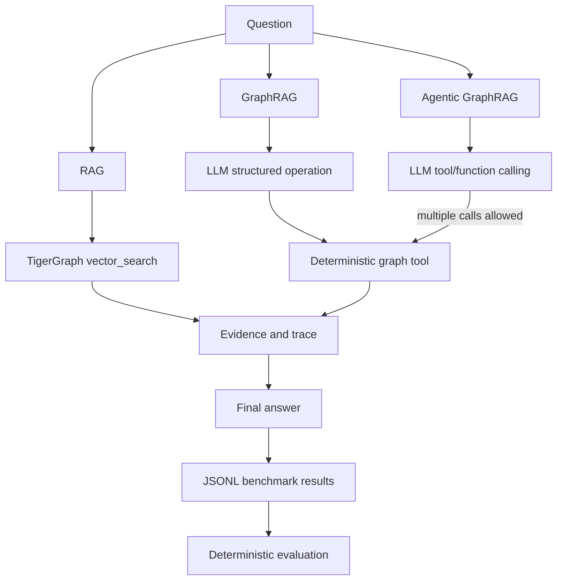

# Olympic GraphRAG Benchmark

Compare conventional RAG, GraphRAG, and Agentic GraphRAG over a 2,951-document Olympic-events corpus. All vector retrieval stays in TigerGraph; embeddings are stored on `chunk.embedding` and queried through TigerGraph's HNSW index.

## Architecture



## TigerGraph

The configured graph is `wikipedia_corpus`:

- Vertices: 2,951 `Document`, 2,162 `events`, 21 `OlympicEdition`, 25,430 `chunk`.
- Edges: 2,162 `describes`, 2,162 `part_of`, 25,430 `contains`, 1,550 event-to-event `preceded_by`.
- Embeddings: 25,430 384-dimensional `all-MiniLM-L6-v2` vectors on `chunk.embedding`; cosine similarity and HNSW index.

The six installed queries have Python wrappers in `backend/tools/`: `event_lookup`, `event_filter`, `event_aggregate`, `temporal_search`, `vector_search`, and `graph_context`. Each returns a normalized success/error envelope. The graph must not be rebuilt for this application.

## Pipelines

- **RAG** embeds the question locally, retrieves top-k chunks from TigerGraph, then asks the LLM to answer from those chunks.
- **GraphRAG** asks the LLM for a structured operation, calls one deterministic graph tool, then synthesizes from its evidence.
- **Agentic GraphRAG** gives the model all six tools and supports repeated model-selected calls, evidence inspection, and a final answer. `--max-tool-turns` bounds the loop.

The benchmark aggregation example (`Biathlon`, `2018 Winter Olympics`, competitor count `> 73`) is answered by `event_aggregate`; TigerGraph returns 5 without asking the LLM to count retrieved text.

## Setup

Use Python 3.10 or later. Install dependencies:

```powershell
python -m venv .venv
.venv\Scripts\Activate.ps1
pip install -r requirements.txt
Copy-Item .env.example .env
```

Edit `.env` locally. Never commit it. The Gemini key previously pasted in chat was not copied into `.env`; revoke/rotate it and put the replacement directly in your local `.env` as `GEMINI_API_KEY`.

Relevant settings:

- `TIGERGRAPH_HOST`, `TIGERGRAPH_GRAPH`, `TIGERGRAPH_SECRET` configure the graph. Legacy `TG_HOST`, `TG_GRAPHNAME`, and `TG_SECRET` remain supported.
- `LLM_PROVIDER=gemini` selects Gemini. Set `GEMINI_API_KEY`, optionally `GEMINI_MODEL` (default `gemini-2.5-flash`).
- `LLM_PROVIDER=openai-compatible` selects the OpenAI-compatible adapter using `OPENAI_API_KEY` or `LLM_API_KEY`; optional model/base URL settings are in `.env.example`.
- `LLM_PROVIDER=huggingface` uses the Hugging Face OpenAI-compatible Router. Set `HF_TOKEN` locally and choose `HF_MODEL` (default `openai/gpt-oss-120b:fastest`); `HF_BASE_URL` defaults to `https://router.huggingface.co/v1`.
- `LLM_TEMPERATURE` defaults to `0`; `EMBEDDING_MODEL` defaults to `all-MiniLM-L6-v2`.
- `TIGERGRAPH_AUTO_START`, `TIGERGRAPH_START_TIMEOUT`, and `TIGERGRAPH_POLL_INTERVAL` control readiness behavior.

Do not paste secrets into commands, logs, benchmark data, or chat.

## TigerGraph Readiness

Check status and verify the graph contract:

```powershell
python -m backend.services.tigergraph_service status
python -m backend.services.tigergraph_service verify
python -m backend.cli tigergraph verify
```

`python -m app --check` performs the same readiness gate. `python -m app` enters a console question loop after verification when attached to a terminal. Repeating either command does not recreate or reload graph resources.

VS Code also has a `runOn: folderOpen` task that runs the non-mutating readiness check when the workspace is opened (after workspace trust permits tasks). It does not start a stopped Savanna workspace.

The repository has graph connection credentials, but no Savanna workspace-control credentials or start API. Therefore automatic wake-up is not claimed: if the workspace is stopped, start it in Savanna, then rerun. `start` is idempotent when the graph is already reachable and reports this limitation when it is down. Health checks verify reachability, graph/schema, required query endpoints, and vector-index configuration.

## Run One Question

```powershell
python -m backend.cli run rag "Which canoeing event was held at the 2012 Olympics?"
python -m backend.cli run graphrag "How many biathlon events at the 2018 Winter Olympics had more than 73 competitors?"
python -m backend.cli run agentic "Which event preceded Q303623?"
```

Results can be appended to a JSONL trace with `--output path`. Agentic traces retain calls, arguments, results, errors, evidence, and final answer.

## Browser Demo

Start the local browser demo after the graph readiness check:

```powershell
python -m app --web
```

Open `http://127.0.0.1:8000`. The question console can run RAG, GraphRAG, Agentic GraphRAG, or compare all three, and displays answers, latency, provider-reported token usage, tool calls, and evidence. The server binds to localhost by default; use `--host` and `--port` only when you intentionally need another bind address.

## Benchmark

The default benchmark combines all 100 public and 50 hidden questions. Run one system or all three:

```powershell
python -m benchmark.run --pipeline rag
python -m benchmark.run --pipeline graphrag
python -m benchmark.run --pipeline agentic
python -m benchmark.run --pipeline all
```

Options include `--input` (repeat to combine files), `--output`, `--limit`, `--question-id`, `--resume`, `--parallel` / `--sequential`, `--workers`, `--top-k`, and `--max-tool-turns`. Sequential is the default for rate limits and reproducibility. Parallel execution is opt-in.

Each result row records run ID, timestamp, question ID/text, expected answer if present, pipeline, answer, correctness, latency, reported token usage, tool calls, evidence, errors, and model/graph configuration. Hidden records have no expected answer, so their correctness remains `null`. Result files live under `results/runs/` by default and are Git-ignored; do not publish files containing hidden question text.

## Evaluation

Evaluate a saved JSONL run:

```powershell
python -m evaluation.evaluate --input results/runs/RUN.jsonl
```

The evaluator reports per-question outcomes and metrics by pipeline and question type: normalized exact match, numeric match, order-independent list/set match, and a constrained unique phrase match for superlative answers. It normalizes diacritics and punctuation. It reports accuracy over scorable questions, average/median latency, p95 latency when at least 20 samples exist, token averages/totals only where usage is reported, tool-call totals, and failure rate. It does not collapse these into an invented overall score or use an LLM judge.

LLM token counts are API-provided values only. Missing usage remains `null`; TigerGraph queries, Python routing, and local embedding calls count as zero LLM tokens. No token estimates are made.

## Tests

Offline tests use fake models/connections and need no LLM key:

```powershell
python -m unittest discover -s tests -p test_pipeline_contracts.py -v
python -m unittest discover -s tests -p test_hackathon_runtime.py -v
python -m unittest discover -s tests -v
```

Live smoke checks require an available TigerGraph workspace and local `.env`, for example `python tests/test_vector.py`. They are separate from the offline unit tests.

## Limitations

The browser demo is a local comparison surface, not a public hosted service. A full 150-question live benchmark still requires a configured LLM provider and can be subject to model rate limits/costs. The console and benchmark use sequential execution by default for reproducibility.

The hidden benchmark has no gold answers in the local file, so accuracy cannot be calculated for those 50 questions. Live LLM execution also requires a rotated local Gemini key or another configured provider. Savanna auto-start remains unavailable unless TigerGraph supplies an authorized lifecycle API and credentials.

## Data Source

The corpus is derived from English Wikipedia and carries CC BY-SA 4.0 attribution in the source records. The corpus, rather than current external information or model memory, is the benchmark source of truth.
