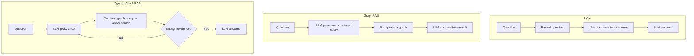
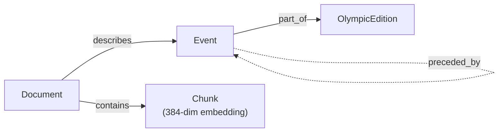

# From Keyword Search to Agentic GraphRAG: What I Learned Building a Question-Answering System for the TigerGraph Hackathon

**TL;DR:** I built and benchmarked three question-answering pipelines — RAG, GraphRAG, and Agentic GraphRAG — on the same 100-question Olympics benchmark over a 2,951-document corpus. Agentic GraphRAG won by **2.24x** over plain RAG and **1.24x** over single-shot GraphRAG, while also failing less often. Here's the whole journey: what each approach is, where it breaks, and why the next one exists.

If you've ever typed a question into a search engine and gotten ten blue links instead of an answer, you already understand the problem this whole field is trying to solve. This post walks through that problem step by step — from plain keyword search, to embeddings, to RAG, to GraphRAG, to what I actually built: an Agentic GraphRAG system, benchmarked against 100 real questions.

---

## Step 1: Keyword search — the oldest trick in the book

The simplest way to find information is to match words. You type "biathlon 2018 winter olympics," and the system finds documents containing those exact words. This is how search worked for decades, and it still partly does.

The problem: **words aren't meaning.** If a document says "the biathlon competition at the Pyeongchang Games" and never literally uses the words "2018 Winter Olympics," keyword search might miss it entirely. It doesn't know that "Pyeongchang Games" and "2018 Winter Olympics" refer to the same thing.

## Step 2: Semantic search — search by meaning, not words

Semantic search fixes this by converting text into **embeddings** — long lists of numbers (384 numbers per chunk, in my project) that represent the *meaning* of a piece of text, not its exact wording. Two sentences with similar meaning end up with similar numbers, even if they don't share a single word.

To search, you convert your question into the same kind of number-list, then find which documents' numbers are "closest" to your question's numbers — I used cosine similarity, basically a measure of how aligned two number-lists are. This is a real improvement: now "Pyeongchang Games" and "2018 Winter Olympics" can match, because they mean the same thing even though they're spelled differently.

## Step 3: RAG — giving the LLM real information to work with

Semantic search finds the right *documents*, but it doesn't *answer* your question. That's where an LLM comes in. RAG (Retrieval-Augmented Generation) is a simple recipe:

1. Convert the question to an embedding
2. Find the top-k most similar chunks of text
3. Hand those chunks to the LLM and say "answer using only this"

This matters because LLMs don't actually know everything, and they can't see documents you haven't shown them. RAG lets you extend an LLM's knowledge with your own data, without retraining anything.

## Step 4: RAG missed every relevant chunk at k=5

I built a corpus of Wikipedia Olympic-event pages and ran a real question through RAG:

> "How many biathlon events at the 2018 Winter Olympics had more than 73 competitors?"

The correct answer, sitting in my data, is **5**. RAG got it wrong. So I went digging, and found something worth sharing:

| `top_k` | Relevant 2018 biathlon chunks retrieved |
|---|---|
| 5 | 0 |
| 10 | 0 |
| 20 | 1 |
| 50 | 5 of 8 needed |

Why? Vector search finds chunks that are *semantically similar to the question* — but this question isn't really about *one* similar chunk, it's about counting across many documents that share a category (2018, Winter Olympics, biathlon, more than 73 competitors). No single chunk "is" the answer. The answer only exists if you gather *all* the relevant documents and count. Semantic similarity search was never designed to do that.

To confirm this wasn't an LLM problem, I manually fed the model the complete set of 11 relevant documents. It answered correctly, instantly.

> The retrieval step — not the reasoning step — was the bottleneck. Before you blame the model, check what it was actually given.

## Step 5: GraphRAG — structure instead of similarity

If the problem is "I need to gather *all* documents matching a category," the fix is obvious once you see it: use a database that can filter and count, instead of one that can only find "similar" things.

That's GraphRAG's idea. Instead of embedding text and searching by similarity, you build a graph: entities (in my case, Olympic events) as nodes, with structured attributes (sport, year, venue, competitor count) and relationships between them — this event belongs to this Olympic edition, this event's predecessor was this other event four years earlier.

Now the biathlon question becomes a database query, not a similarity search:

```
WHERE sport = "Biathlon"
  AND edition = "2018 Winter Olympics"
  AND competitors > 73
COUNT()
```

Deterministic. Exact. No missing evidence. When I ran this through my graph, it correctly returned **5**.

## Step 6: GraphRAG commits to one guess and can't recover

GraphRAG's weakness is the opposite of RAG's: it's rigid. It has to correctly guess, in *one shot*, exactly what structured query the question needs — and Olympic-page data is messier than it looks.

- My infoboxes stored dates under a `date` key for most events, but `dates` (plural) for events with separate heat and final rounds.
- Competitor counts existed for most events but not all of them.
- Some infoboxes described the same 2018 Winter Olympics as `"2018 Winter Olympics"`, others as `edition="2018", season="Winter"` — and an early bug in my pipeline normalized these two forms differently, so GraphRAG confidently returned **zero** results for a question whose answer was sitting right there, just filed under a slightly different label than the one it searched for.

Fixing that normalization was a real bug fix, not a benchmark-specific hack — and it mattered, because the deeper issue is structural: **GraphRAG has no way to notice its own query returned nothing useful and try something else.** It commits to one plan and reports whatever that plan finds, wrong assumptions and all.

## Step 7: Agentic GraphRAG — let the model decide, and recover

The fix for "commits to one wrong plan" is to let the model reconsider. Instead of one fixed pipeline, an agentic system gives the LLM a toolbox and lets it work in a loop:

1. Call a tool
2. Look at what came back
3. Decide: is this enough to answer, or do I need another tool?
4. Repeat, or answer

I gave my agent six tools — `event_lookup`, `event_filter`, `event_aggregate`, `temporal_query`, `graph_context`, and `vector_search` — so it could combine deterministic graph queries *and* semantic search when useful, rather than being locked into one strategy per question. If a filter comes back empty, the agent can try a different filter instead of just reporting zero.

Laid out side by side, the structural difference is the loop:



RAG and GraphRAG are both straight lines — one retrieval step, then an answer, no matter what comes back. Agentic GraphRAG is the only one with a decision point that can send it back for more evidence, which is exactly the capability that let it recover from a bad first guess.

---

## The project itself

The corpus: 2,951 Wikipedia documents, of which 2,162 are Olympic-event infoboxes (the rest — films, officeholders, scientists — are noise/distractor documents that happened to be in the same dump). I built a graph in TigerGraph Savanna with:

```
Document -[describes]-> Event -[part_of]-> OlympicEdition
Event -[preceded_by]-> Event
Document -[contains]-> Chunk   (384-dim embedding per chunk, for vector search)
```



Getting the data *into* this shape was, honestly, most of the actual engineering effort. A first extraction pass had a **60% failure rate** before I found the loader was misreading multi-line JSON, and even after that, half the "date" fields turned out to use a `dates:` (plural) key I hadn't accounted for. Nothing about building an agent is interesting if the data underneath it is wrong — I spent more hours debugging infobox parsing and TigerGraph loading jobs than I did writing the actual agent loop.

## The benchmark

I ran all three pipelines on the same 100 public questions (with known answers) and 50 hidden questions (operational metrics only), using the same LLM for every pipeline — so the comparison isolates *strategy*, not model quality.

| Pipeline | Accuracy | Failure rate | Avg latency |
|---|---|---|---|
| RAG | 18.0% | 0% | 20.3s |
| GraphRAG | 32.5% | 17% | 66.7s |
| **Agentic GraphRAG** | **40.4%** | **6%** | 33.8s |

**Agentic GraphRAG beat plain RAG by 2.24x** (+124% relative), and **beat single-shot GraphRAG by 1.24x** (+24% relative) — while also failing less often than GraphRAG (6% vs 17%), despite using more tokens and more tool calls per question. That last part surprised me: I expected the extra reasoning step to cost more for a modest accuracy gain, not to *also* make the system meaningfully more robust to bad first attempts.

## What I'd tell someone starting this

The progression — keyword → semantic → RAG → GraphRAG → agentic — isn't a ladder where each step obsoletes the last. Each one fixes a specific failure mode of the one before it, and each fix introduces a new failure mode of its own.

My biggest lesson: **don't assume the LLM is the weak link.** In my case, it wasn't — twice. First when RAG's retrieval coverage was the actual bottleneck, and again when GraphRAG's normalization bug was silently eating correct answers. The agent architecture only pays off once you've actually diagnosed what's breaking underneath it.
